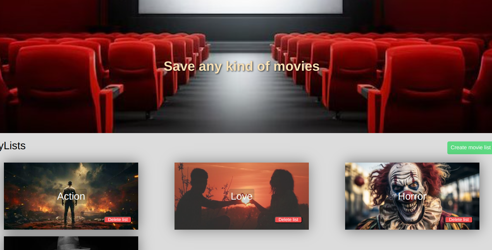

Watch-List Creation Application
This application has allowed me to work with a MERN stack (MongoDB, Express.js, React, Node.js) and implement a structured MVC architecture.

Objective
The objective of this project is to create a user-friendly application for managing personalized movie lists. Users can create lists with custom names, upload images for their lists, add movies from a pre-registered database, leave comments on movies, and efficiently manage their lists by adding or deleting movies as needed.

Features
List Creation
Create a List: As a user, you can create a movie list with any name you choose.
Upload an Image: You can add an image to your list by uploading it from your computer.
Movie Management
Add Movies: You can add movies to your lists from the pre-registered movie database.
Comment on Movies: For each movie added, you can leave a personal comment.
Deletion
Delete a List: You can delete an entire movie list if you no longer need it.
Delete a Movie: You have the option to delete a specific movie from a list.
Usage
Create a List:

Go to the "Create a List" tab.
Enter the name of your list and upload an image from your computer.
Click "Create".
Add Movies:

Go to the list you have created.
Click "Add a Movie".
Select a movie from the database.
Add a comment if you wish.
Click "Add".
Delete a List:

Go to the list you want to delete.
Click "Delete List".
Delete a Movie from a List:

Open the list containing the movie you want to delete.
Click the delete icon next to the movie.
Contact
For any questions or suggestions, please open an issue on GitHub or contact us via email at damiendp94@gmail.com.

Thank you for using our Movie List Creation Application!

